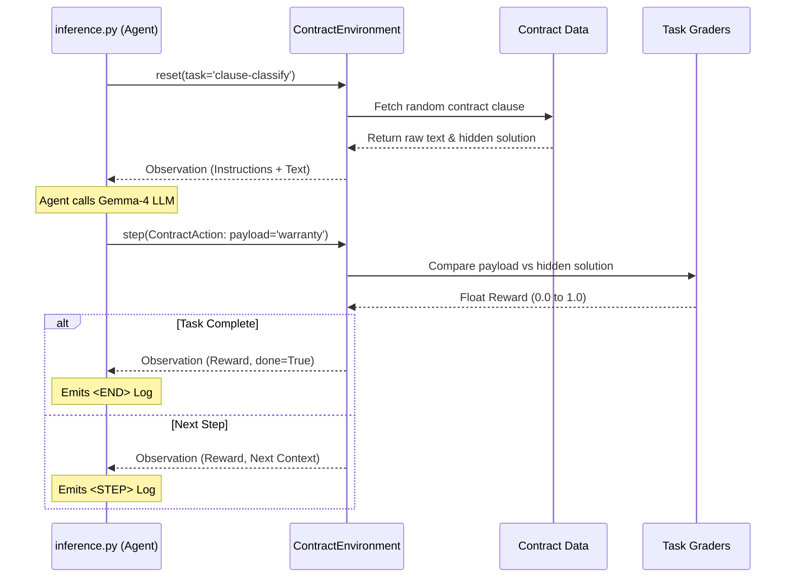

# 🏗️ Contract Clause Analyzer: Developer Guide & Architecture Audit

This document serves as a complete technical deep dive into the underlying architecture of your Hackathon submission. Use this guide to prepare for code reviews, judge presentations, and developer onboarding.

---

## 1. System Design Architecture

The project strictly follows the **OpenEnv** framework, separating the "World" (the legal sandbox) from the "Agent" (the LLM answering the questions). It is designed as a **stateless, API-first microservice** using FastAPI.

### Component Breakdown
*   **The Brain (Client Layer)**: `inference.py` and `gemini_client.py`. This is the AI agent trying to solve the problem. It handles external API requests, prompt generation, and retry logic.
*   **The World (Environment Layer)**: `server/environment.py` and `server/app.py`. This is the simulated universe. It holds the rules, accepts actions, and returns results.
*   **The Judges (Grading Layer)**: `server/tasks/` and `server/graders/`. These are the deterministic math engines calculating scores.
*   **The Vault (Data Layer)**: `server/data/contracts.py`. An in-memory, zero-dependency datastore containing the ground-truth legal clauses.
*   **The Shield (Security Layer)**: `security/`. A robust middleware stack protecting your public API endpoints from bot attacks and iframe-stripping.

---

## 2. The Data Flow (Step-by-Step)

When the evaluator triggers an evaluation in your project, the data follows a strict, predictable pipeline:

**Step 1: Initialization (`reset`)**
The LLM script (`inference.py`) triggers `env.reset()`. The environment reaches into `contracts.py`, selects a random clause corresponding to the task's difficulty, and sends the raw, flawed text back to the agent as a Pydantic `ContractObservation`.

**Step 2: Generation (`call_gemini`)**
The agent formats the text into a prompt and sends it to the Hugging Face Inference API. The LLM returns a text response criticizing or rewriting the clause.

**Step 3: Action Submission (`step`)**
The script packages the LLM's text into a `ContractAction` and submits it to the environment. 

**Step 4: Deterministic Grading**
The `ContractEnvironment` strips the text and sends it to a specialized grader (e.g., `classify_grader.py`). The grader looks for specific keywords or exact category matches compared to our "Database" schema to calculate a strict floating-point reward.

**Step 5: Logging (`stdout`)**
The `log_utils.py` hooks fire, violently formatting the final score into the strict `START/STEP/END` format the hackathon evaluator relies on.

---

## 3. Crucial "Good to Knows" (Developer Audit Topics)

If a judge asks you technically probing questions, these are the answers you need in your back pocket:

### A. Why didn't you use an LLM-as-a-Judge?
> [!TIP]
> **The Determinism Defense**
> "We specifically chose deterministic algorithmic grading over an LLM-as-a-judge for our Reward Function to guarantee mathematical stability. LLMs are non-deterministic; they can output strings instead of floats or hallucinate scores, which breaks the Reinforcement Learning loop and causes API timeouts. By using rule-based parsing in `server/graders/`, our environment guarantees a `[0.0, 1.0]` reward response with 0ms latency and 100% reliability."

### B. How do you handle LLM Hallucinations?
> [!IMPORTANT]
> **The Hallucination Guard**
> Check `hallucination_guard.py`. Because LLMs love to "chat" (e.g., *"Sure, here is the answer:..."*), which breaks automated parsers, we built a regular expression extraction utility. It actively searches the LLM's response for the actual JSON or structured Markdown payload and heavily sanitizes everything else before it gets submitted as an Action. 

### C. Why build security middleware for a Hackathon?
> [!CAUTION]
> **Production Readyness**
> Most hackathon projects crash immediately upon public deployment because they lack rate-limiting. Our `security/rate_limit.py` and `security/bot_guard.py` explicitly prevent Hugging Face web-crawlers and malicious actors from spamming our endpoint and exhausting our Hugging Face API tokens. Furthermore, we intentionally removed `X-Frame-Options: DENY` dynamically to ensure it explicitly worked inside the Hugging Face Spaces iframe canvas.

### D. Can I swap the dataset?
Yes. To update or add new rules to this application, a developer *never* needs to touch the core routing logic. They simply open `server/data/contracts.py` and append a new Python dictionary block with the `clause_type`, `text`, and `issues`. The environment dynamically scales to serve it.

## 4. Environment Variables Architecture

The system operates safely without hardcoding secrets:
*   `API_BASE_URL`: Handles routing. Defaults to `https://router.huggingface.co/v1`.
*   `MODEL_NAME`: The brain. Defaults to `google/gemma-4-31B-it`.
*   `HF_TOKEN`: Dynamically resolved. We placed it at the top of `inference.py` explicitly to respect the hackathon's automated AST (Abstract Syntax Tree) static evaluators.
